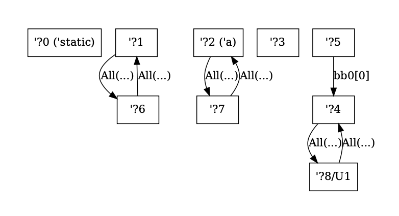
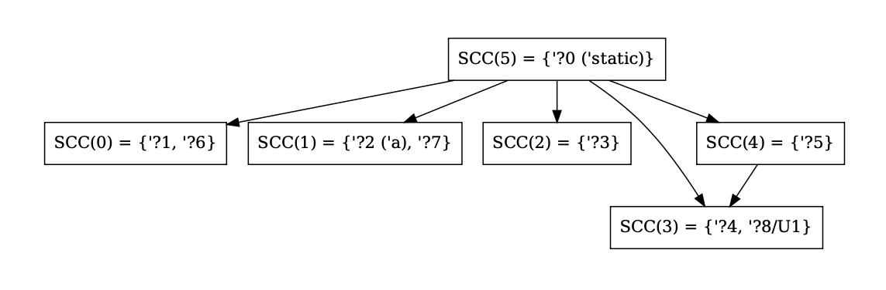

# Debugging the borrow checker

## Region Constraint Graphs and Their Strongly Connected Components

With `-Z dump-mir-graphviz=yes`, you will also get Graphviz files for the outlives constraints
of the MIR bodies you asked for, as well as the strongly connected components (SCCs) on them.
They are available as
`mir_dump/rs-file-name.function-name.-------.nll.0.regioncx.all.dot` and
`mir_dump/rs-file-name.function-name.-------.nll.0.regioncx.scc.dot` respectively. For both
graphs, named region variables will be shown with their external name (such as `'static`)
shown in parenthesis. For region inference variables in universes other than the root universe,
they will be shown as `/U13` (for universe 13). In the region graph, edges are labelled with
the MIR location where the relationship is required to hold, or `All` if the constraint should always be true.

**Note:** There are implicit edges from `'static` to every region, but those are not rendered
in the region graph to avoid clutter. They _do_ however show up in the SCC graph. This is why there are outgoing edges from `SCC(5)` in the SCC graph that do not seem to have corresponding edges in the region outlives graph above.

## See also

The [general instructions on debugging dataflow]() also apply to graphs generated from
borrowcheck data.
