# Overview of the compiler

In this chapter, we aim to describe `rustc` at a very high-level to show how the
various areas work together. We introduce the _demand-driven architecture_ and
the organization of `rustc` areas by their information dependency into a graph.
For each area, we describe their purpose and motivation, and provide a small
summary with links to chapters that go into more detail.

> **UNDER CONSTRUCTION**
>
> - This section lacks motivation and reasoning for the query architecture.
>
> **UNRESOLVED QUESTIONS** How do we describe the relationship between trait
> solving and the areas that it intertwines with? How do we describe error
> handling and `rustc_interface`? Where/how do we describe distinction between
> early lints and late lints? Do we talk about them briefly in this section
> already?

Conventional compiler texts often describe traditional compilers as being
organized into linear _passes_, where a pass eagerly produces information for a
subsequent pass to consume. `rustc` is organized a bit differently. `rustc` for
the most part adopts an "demand-driven" system, where one area provides
information for another area that demands it via lazily-computed _queries_. If
we view the compiler's knowledge about a crate as a database, then queries are
functions which asks the database for information. Initially, this database of
information is empty. It can be populated on-demand by area requests for
information by queries. Queries can demand information from other sub-queries,
which in turn can demand information from area providers. This information
dependency flow forms a directed acyclic graph (DAG) at the item granularity
whose nodes are queries and leaves are areas which provide the demanded
information.

> **UNDER CONSTRUCTION** Insert a query diagram to illustrate the above point.

Ideally, the entire compiler would be organized as queries. However, as of the
time of writing (March 2024), `rustc` still has several areas which are not yet
querified and work like conventional passes. The following diagram illustrates
this distinction as well as the information dependency between areas.

> **FIXME** What do we want the arrows to **actually** mean?

```graphviz
digraph rustc_areas {
    graph [pad="0.5", nodesep="0.5", ranksep="0.3", compound=true];
    node [color=Black, shape=box];
    edge [color=Blue];

    Executable [shape=oval, label="Executables, cdylibs, staticlibs"]
    Libraries [shape=oval, label="rlibs, dylibs"]
    "Source Code" [shape=oval]

    Executable->{"LLVM", "GCC", "Cranelift"} [color="darkgreen", style="bold", arrowhead=none]
    Libraries->{"LLVM", "GCC", "Cranelift"} [color="darkgreen", style="bold", arrowhead=none]
    "LLVM"->{"SSA Code Generation"} [color="darkgreen", style="bold", arrowhead=none]
    "GCC"->{"SSA Code Generation"} [color="darkgreen", style="bold", arrowhead=none]
    "Cranelift"->{"Monomorphization Collection"} [color="darkgreen", style="bold", arrowhead=none]
    "Libraries"->{"Metadata Encoding"} [color="darkgreen", style="bold", arrowhead=none]

    subgraph cluster_querified {
        graph[style=dashed, bgcolor="lightblue"]

        subgraph cluster_trait_solving_dependent {
            graph[style=solid]
            "SSA Code Generation"->{"Monomorphization Collection"}
            "Monomorphization Collection"->{"MIR Building, Transformations and Analysis"}
            "Metadata Encoding"->{"MIR Building, Transformations and Analysis"}
            "MIR Building, Transformations and Analysis"->{"THIR Building and Analysis"}
            "THIR Building and Analysis"->{"HIR Body Type-checking"}
            "HIR Body Type-checking"->{"HIR Well-formedness Checking"}

            label = "Trait-solving dependent"
            labelloc=t
            labeljust=r
        }

        "SSA Code Generation" -> "Trait System" [ltail=cluster_trait_solving_dependent lhead=cluster_querified];

        "HIR Well-formedness Checking"->{"HIR Type Lowering"}
        "HIR Type Lowering"->{"HIR Building"}
        "HIR Building"->"Late Name Resolution" [color="red", style="dashed", dir=back]

        "Trait System"->{"HIR Well-formedness Checking", "HIR Body Type-checking", "THIR Building and Analysis", "MIR Building, Transformations and Analysis"}

        label = "Querified"
        labelloc=t
        labeljust=r
    }

    subgraph cluster_non_querified {
        graph[style=dashed, bgcolor=lightyellow]
        "Late Name Resolution"
        "Late Name Resolution"->{"AST Validation"}[color="red", style="dashed", dir=back]
        "AST Validation"->{"Macro Expansion, Metadata Loading and Early Name Resolution"} [color="red", style="dashed", dir=back]
        {"Macro Expansion, Metadata Loading and Early Name Resolution"}->{"Parsing"} [color="red", style="dashed", dir=back]
        {"Parsing"}->{"Macro Expansion, Metadata Loading and Early Name Resolution"} [color="red", style="dashed", dir=back]
        "Parsing"->{"Tokenization"} [color="red", style="dashed", dir=back]
        "Tokenization"


        label="Non-querified"
        labelloc=t
        labeljust=r
    }

    "Source Code"
    {"Tokenization"}->"Source Code" [color="red", style="dashed", dir=back]

    subgraph cluster_legend {
        rankdir=LR
        node [shape=plaintext, width=0]
        label = "Legend";
        {rank=same; key, key2 }
        key [label=<<table border="0" cellpadding="2" cellspacing="0" cellborder="0">
        <tr><td align="right" port="i1">Pull-based Dependency </td></tr>
        <tr><td align="right" port="i2">Push-based Dependency </td></tr>
        <tr><td align="right" port="i3">Code Generation Pathway </td></tr>
        </table>>]
        key2 [label=<<table border="0" cellpadding="2" cellspacing="0" cellborder="0">
        <tr><td port="i1"> </td></tr>
        <tr><td port="i2"> </td></tr>
        <tr><td port="i3"> </td></tr>
        </table>>]
        key:i1:e -> key2:i1:w [color="blue"]
        key:i2:e -> key2:i2:w [color="red", style="dashed"]
        key:i3:e -> key2:i3:w [color="darkgreen", style="bold"]
  }
}
```

<!-- graphviz source kept here to help reproduce the diagram

-->

To produce the final executable, we take one of the several code generation
pathways. For example, to produce an executable following the LLVM pathway, we
rely on the synthesis of LLVM IR from SSA code generation. Code generation in
turn relies on information produced by Monomorphization Collection, and so on.
We keep following the dependencies for the querified areas until we reach HIR
Lowering, which depends on information from non-querified areas of the compiler.
At that boundary, we make a distinction between the pull-based information
dependency of querified areas versus push-based information dependency of the
non-querified areas.

To pass information between areas, the compiler uses various _Intermediate
Representations_ (IRs), which provide common interfaces to allow areas to
communicate with each other. These include but are not limited to:

- Tokens
- Abstract Syntax Tree (AST)
- High-Level Intermediate Representation (HIR)
- Mid-Level Intermediate Representation (MIR)

These various IRs gradually transform surface Rust syntax by simplications of
language constructs and enriches the information available to lower-level areas
by many analyses.

We will explain each area in more detail in the next section.

## Brief Summaries of the Areas

### The Compiler Driver and the Interface

> **TODO** write about this

### Non-Querified Areas

#### Tokenization

The compiler takes the input, a stream of Unicode characters, and transforms it
into a sequence of
[`Token`](https://doc.rust-lang.org/nightly/nightly-rustc/rustc_ast/token/index.html)s
called a
[`TokenStream`](https://doc.rust-lang.org/nightly/nightly-rustc/rustc_ast/tokenstream/struct.TokenStream.html).
This has multiple benefits:

- Separation of concerns: the lexer can be concerned with lower-level details
  such as interning identifiers, collecting numeric literals, identifying
  keywords and operators, associating source locations with the token, and
  generate useful error reports for these cases. This simplifies the job of the
  parser as it can then work with tokens, which is a higher level construct than
  Unicode characters.
- Simplifying the grammar: with a separate lexer, the parser can focus on
  accepting a valid program according to a grammar defined in terms of _tokens_
  instead of individual Unicode characters.

See [Lexing and Parsing](https://rustc-dev-guide.rust-lang.org/the-parser.html)
for more details.

#### Parsing

Given a token stream, the compiler builds a Abstract Syntax Tree (AST) that has
a tree structure to enable tree-based reasoning and effectively represent the
syntactical structure of the program. Rust has a macro system, which means that
macros will need to be expanded in order to construct the full AST. Initially, a
pre-expansion AST is constructed with placeholders for macros that are pending
expansion.

See [Lexing and Parsing](https://rustc-dev-guide.rust-lang.org/the-parser.html)
for more details.

#### Macro Expansion, Metadata Loading, Early Name Resolution and Late Name Resolution

> **TODO**: this section needs a lot of work because I don't understand this
> area too well so far

After the pre-expansion AST is constructed, the compiler tries to build the full
AST for a crate which has all macros expanded and all modules inlined.
Unresolved macros are iteratively expanded, which requires resolving imports and
macro names early (i.e. Early Name Resolution), but not other names yet.

For import suggestions, the compiler may try to perform speculative crate
loading via reading crate metadata that does not produce diagnostics for the
speculatively loaded crate for import suggestion candidates.

See [Macro
Expansion](https://rustc-dev-guide.rust-lang.org/macro-expansion.html) and [Name
Resolution](https://rustc-dev-guide.rust-lang.org/name-resolution.html) for more
details.

#### AST Validation

Some basic sanity checks are performed on the AST, such as not having more than
`u16::MAX` parameters, to catch some obvious user errors as well as errors in
AST construction / macro expansion.

See [AST Validation](https://rustc-dev-guide.rust-lang.org/ast-validation.html)
for more details.

### Querified Areas

#### HIR Building

High-level Intermediate Representation (HIR) is a lower-level IR than AST. When
compared to AST, HIR has desugared constructs (such as desugaring `for` loops
into `loop`s) to make analysis easier. When compared to MIR, HIR resembles the
surface Rust syntax more closely. 

HIR building is the lowering from Abstract Syntax Tree (AST) into HIR. HIR is
further desugared from AST to simplify analysis. There are sanity checks on the
lowered HIR to catch obvious lowering mistakes.

See [AST Lowering](https://rustc-dev-guide.rust-lang.org/ast-lowering.html) for
more details.

#### HIR Type Lowering

HIR Type Lowering converts the more surface-syntax-like HIR type system entities
(types, lifetimes/regions, constants in type positions) into
[`rustc_middle::ty`](https://rustc-dev-guide.rust-lang.org/ty.html)
representations to express the semantics of the type.

See the [The `ty` module: representing
types](https://rustc-dev-guide.rust-lang.org/ty.html) for more information.

#### HIR Well-formedness Checking

A type is _well-formed_ (WF) when it satisfies a set of requirements which are
fundamental to the type's validity. The requirements are type-specific, for
example:

- For a tuple to be WF, all elements except for the last needs to be `Sized`.
- For an algebraic data type (struct/enum/union) to be WF, its generics need to
  satisfy the `where` clauses on the ADT.

The notion of type well-formedness can be inductively extended for entities that
contain types, such as trait predicates. A trait predicate `T0: Trait<P1, ...>`
is well-formed if `T0` and `P1, ...` are well-formed in addition to `Trait`'s
`where` clauses being satisfied.

HIR well-formedness checking is an early collection of checks on mostly surface
Rust syntax (such as parameters, local variables and return types) which are run
before further type-checking and inference, for two purposes:

1. For better error-reporting: a program which is not WF is more likely to give
   hard-to-understand or spurious errors.
2. To enable making simplifying assumptions in later HIR typeck: such as not
   having to check if a tuple's fields are `Sized` when type checking a
   `tuple.0` expression.

The HIR is _well-formed_ (WF) when it satisfies a set of requirements that
include but are not limited to:

- well-formedness of types in type signatures
- object safety is respected
- function call ABI requirements (e.g. for "rust-call") are satisfied
- receiver type can be used as a self type
- variances are compatible
- and many more

Note that HIR WF checking are also not the only place where WF checks take
place: there are further WF checks in THIR/MIR to complement HIR WF checks.

#### HIR Body Type-checking

> 🚧 **TODO** 🚧 (remove the cat meme when complete with draft)

</img>

The goal of HIR body typechecking is to catch mistakes that violate the rules of
the type system, and infer types and other information necessary for THIR/MIR
building. HIR body type-checking recursively walks and checks each expression.
This process produces information such as the type of each expression. During
the process, type inference, implicit cocercions, trait bound checking and
method resolution is performed. Notably,

- Method resolution is not performed in (early/late) Name Resolution because
  type information is required.
- Type inference is performed on HIR and not MIR because HIR maps closer to the
  surface Rust syntax (and retains the tree-based structure), which enables more
  descriptive errors and suggestions to be produced.
- MIR building requires method resolution information from HIR type-checking to
  guide the lowering.

When compared to MIR typeck where all types are specified, HIR typeck has to
infer types. HIR typeck also checks all closures together with their parent body
while MIR typeck/borrowck checks them separately.

See [Type checking](https://rustc-dev-guide.rust-lang.org/type-checking.html)
for more details.

#### Typed High-level Intermediate Representation (THIR) Building and Analysis

Typed High-level Intermediate Representation (THIR) is a further desugared
version of High-level Intermediate Representation (HIR) with full type
information embedded. THIR is the last IR where lexical structure is meaningful
for analysis in the chain of lowering from HIR to THIR to MIR and beyond, where
lower-level IRs transition from being lexically-aware to being dataflow-aware.
For example, unsafeck is performed on THIR and not MIR because we care about the
lexical structure -- whether something exists inside an `unsafe` block
lexically. To further simplify tree-based reasoning, THIR has several
simplifications over HIR:

- Explicit auto-deref/auto-ref and coercions.
- Method calls are desugared into regular function calls.
- Overloaded operators like `+` are lowered into function calls or builtin
  operations.
- Match ergonomics are desugared.

With the aforementioned properties, the construction of THIR synthesizes enough
information for MIR building, and makes lowering to MIR easier and less
error-prone than if HIR was attempted to be directly lowered to MIR.

See [The Typed High-level Intermediate
Representation](https://rustc-dev-guide.rust-lang.org/thir.html) for more
details.

#### Mid-level Intermediate Representation (MIR) Building, Transformations and Analysis

Mid-level Intermediate Representation (MIR) is an Intermediate Representation
that is lowered from Typed High-level Intermediate Representation (THIR).
Compared to its precursor THIR, MIR has three key properties that are distinct:

1. _Simplified constructs_: MIR simplifies a lot of the surface language
   syntactical constructs. For example, matches are lowered into a series of
   [`SwitchInt`]s and branches.
2. _Explicit semantic constructs_: MIR makes various semantic aspects of Rust
   that does not appear in the surface syntax explicit. This includes things
   like drops, drop flags, unwinding, codegen intrinsics retags, and others.
3. _Dataflow-aware_: MIR is designed to be dataflow-aware, and removes lexical
   information still present in THIR to enable dataflow-based analysis.

A series of transformations are performed on MIR to prepare it for use by
codegen, Compile-Time Function Evaluation (CTFE), and other analyses. MIR has
three dialects which are distinguished by semantic changes. Within each dialect,
MIR has phases which represent additional constraints on the well-formedness of
MIR within a particular dialect. Dialects and phases are made explicit so that
different consumers of MIR can be provided with a flavor of MIR that has
desirable properties suitable for each of them. Some of the analyses include
borrow-checking, drop elaboration, coroutine transformations, const promotion,
further well-formedness checking and some late type-checking.

```graphviz
digraph mir_transformations {
    graph [pad="0.5", nodesep="0.5", ranksep="0.3"]
    node [color=Black, shape=box, width=5, height=0.5]
    edge [color=Blue]

    built -> analysis_initial
    analysis_post_cleanup -> runtime_initial

    subgraph cluster_built {
        label = "Built Dialect"
        graph[style=bold, bgcolor="lightyellow", labeljust=l]
        built [label="No Distinct Phases"]
    }

    subgraph cluster_analysis {
        label="Analysis Dialect"
        graph[style=bold, bgcolor="lightblue", labeljust=l]
        analysis_initial [label="Initial"]
        analysis_post_cleanup [label="Post Cleanup"]
        analysis_initial -> analysis_post_cleanup
    }

    subgraph cluster_runtime {
        label="Runtime Dialect"
        graph[style=bold, bgcolor="darkseagreen1", labeljust=l]
        runtime_initial [label="Initial"]
        runtime_post_cleanup [label="Post Cleanup"]
        runtime_optimized [label="Optimized"]
        runtime_initial -> runtime_post_cleanup
        runtime_post_cleanup -> runtime_optimized
    }

    subgraph cluster_legend {
        rankdir=LR
        node [shape=plaintext, width=0, height=0.5]
        label = "Legend";
        {rank=same; key, key2 }
        key [label=<<table border="0" cellpadding="2" cellspacing="0" cellborder="0">
        <tr><td align="right" port="i1">Transformation </td></tr>
        </table>>]
        key2 [label=<<table border="0" cellpadding="2" cellspacing="0" cellborder="0">
        <tr><td port="i1"> </td></tr>
        </table>>]
        key:i1:e -> key2:i1:w [color="blue"]
    }

    labelloc=b
    label="Mid-level Intermediate Representation (MIR) Dialects and Phases"
}
```

<!-- graphviz source kept here to help reproduce the diagram

-->

MIR optimizations generally are opportunistic: because we're before
monomorphization, there are e.g. constants related to generic parameters whose
value we cannot know. When an opportunity does arise, however, MIR optimizations
try to achieve one or both of the following objectives:

1. to reduce the amount of work for the codegen backends, and
2. to produce simpler or more optimizable backend output.

See [Mid-level Intermediate
Representation](https://rustc-dev-guide.rust-lang.org/mir/index.html) for more
details.

#### Metadata Encoding

Rust libraries are compiled to archives which consists of object code and
_metadata_. Metadata is used by downstream crates to understand the interface of
upstream crates: including (but are not limited to) exported items, function
signatures, type definitions and MIR for generic functions[^proc-macro]. In this
sense, metadata can be compared to precompiled C headers. Metadata Encoding is
the area responsible for serializing this information into a common binary
format that can be understood by both upstream and downstream crates.

Metadata is serialized via types which implement [`Encodable`], some of which
are derived while others are hand-written implementations. Symmetrically,
metadata can be read back by [`Decodable`] derives and manual deserialization
implementations.

[^proc-macro]: proc macro metadata has a trimmed down version which _only_
    contains the exported macros without anything else defined inside the proc
    macro.

See [Libraries and
Metadata](https://rustc-dev-guide.rust-lang.org/backend/libs-and-metadata.html)
for more details.

#### Monomorphization Collection

Monomorphization collection is the area responsible for collecting _Mono Items_
which contribute to code generation: functions, methods, closures, statics, drop
glue, constants, VTables and object shims. Functions need to be _monomorphized_
-- they might have generic type parameters, in which case the compiler has to
instantiate the functions with the provided type arguments.

See
[Monomorphization](https://rustc-dev-guide.rust-lang.org/backend/monomorph.html)
for more details.

#### The Trait System

> 🚧 **TODO** 🚧 I don't know how to describe the Trait System at all here.

#### Static-Single Assignment (SSA) Code Generation

Static Single Assignment (SSA) code generation is responsible for lowering
Mid-Level Intermediate Representation (MIR) into SSA form (another kind of IR)
which has the property that each variable is assigned to exactly once and is
defined before use. Lowering into SSA form enables more optimizations since it
simplifies the properties of variables. It also makes it easier for code
generation backends to handle. This area abstracts the common code generation
logic and interfaces which code generation backends will need to implement.

In order to lower MIR to SSA, we depend on Monomohprization Collection to
collect _Mono Items_ such as functions, methods and closures which contribute to
code generation.

See [Code
Generation](https://rustc-dev-guide.rust-lang.org/backend/codegen.html) for more
details.

#### Codegen backends: LLVM, GCC and Cranelift

> 🚧 **TODO** 🚧 need more information.

## Additional References and Resources

> **UNDER CONSTRUCTION** This section lacks additional references

### The Query System

- Detailed description of the query system:
  <https://rustc-dev-guide.rust-lang.org/query.html>.
- Design document of On-Demand Compilation and Incremental Compilation:
  <https://github.com/nikomatsakis/rustc-on-demand-incremental-design-doc/blob/master/0000-rustc-on-demand-and-incremental.md>.

### Areas

> **UNDER CONSTRUCTION** This should retain _key entry points_ from the previous
> overview version. Can be very useful. We should expand it a bit. This section
> lacks additional references.
>
> **FIXME**: audit these references and links, they are likely very outdated

- Command line parsing

  - Guide: [The Rustc Driver and Interface](rustc-driver.md)
  - Driver definition:
    [`rustc_driver`](https://doc.rust-lang.org/nightly/nightly-rustc/rustc_driver/)
  - Main entry point:
    [`rustc_session::config::build_session_options`](https://doc.rust-lang.org/nightly/nightly-rustc/rustc_session/config/fn.build_session_options.html)

- Lexical Analysis: Lex the user program to a stream of tokens

  - Guide: [Lexing and Parsing](the-parser.md)
  - Lexer definition:
    [`rustc_lexer`](https://doc.rust-lang.org/nightly/nightly-rustc/rustc_lexer/index.html)
  - Main entry point:
    [`rustc_lexer::cursor::Cursor::advance_token`](https://doc.rust-lang.org/nightly/nightly-rustc/rustc_lexer/cursor/struct.Cursor.html#method.advance_token)

- Parsing: Parse the stream of tokens to an Abstract Syntax Tree (AST)

  - Guide: [Lexing and Parsing](the-parser.md)
  - Guide: [Macro Expansion](macro-expansion.md)
  - Guide: [Name Resolution](name-resolution.md)
  - Parser definition:
    [`rustc_parse`](https://doc.rust-lang.org/nightly/nightly-rustc/rustc_parse/index.html)
  - Main entry points:

    - [Entry point for first file in
      crate](https://doc.rust-lang.org/nightly/nightly-rustc/rustc_interface/passes/fn.parse.html)
    - [Entry point for outline module
      parsing](https://doc.rust-lang.org/nightly/nightly-rustc/rustc_expand/module/fn.parse_external_mod.html)
    - [Entry point for macro fragments][parse_nonterminal]

  - `AST` definition:
    [`rustc_ast`](https://doc.rust-lang.org/nightly/nightly-rustc/rustc_ast/ast/index.html)
  - Feature gating: **TODO**
  - Early linting: **TODO**

- The High Level Intermediate Representation (HIR)

  - Guide: [The HIR](hir.md)
  - Guide: [Identifiers in the HIR](hir.md#identifiers-in-the-hir)
  - Guide: [The `HIR` Map](hir.md#the-hir-map)
  - Guide: [Lowering `AST` to `HIR`](ast-lowering.md)
  - How to view `HIR` representation for your code `cargo rustc -- -Z
    unpretty=hir-tree`
  - Rustc `HIR` definition:
    [`rustc_hir`](https://doc.rust-lang.org/nightly/nightly-rustc/rustc_hir/index.html)
  - Main entry point: **TODO**
  - Late linting: **TODO**

- Type Inference

  - Guide: [Type Inference](type-inference.md)
  - Guide: [The ty Module: Representing Types](ty.md) (semantics)
  - Main entry point (type inference):
    [`InferCtxtBuilder::enter`](https://doc.rust-lang.org/nightly/nightly-rustc/rustc_infer/infer/struct.InferCtxtBuilder.html#method.enter)
  - Main entry point (type checking bodies): [the `typeck`
    query](https://doc.rust-lang.org/nightly/nightly-rustc/rustc_middle/ty/struct.TyCtxt.html#method.typeck)

    - These two functions can't be decoupled.

- The Mid Level Intermediate Representation (MIR)

  - Guide: [The `MIR` (Mid level IR)](mir/index.md)
  - Definition:
    [`rustc_middle/src/mir`](https://doc.rust-lang.org/nightly/nightly-rustc/rustc_middle/mir/index.html)
  - Definition of sources that manipulates the MIR:
    [`rustc_mir_build`](https://doc.rust-lang.org/nightly/nightly-rustc/rustc_mir_build/index.html),
    [`rustc_mir_dataflow`](https://doc.rust-lang.org/nightly/nightly-rustc/rustc_mir_dataflow/index.html),
    [`rustc_mir_transform`](https://doc.rust-lang.org/nightly/nightly-rustc/rustc_mir_transform/index.html)

- The Borrow Checker

  - Guide: [MIR Borrow Check](borrow_check.md)
  - Definition:
    [`rustc_borrowck`](https://doc.rust-lang.org/nightly/nightly-rustc/rustc_borrowck/index.html)
  - Main entry point: [`mir_borrowck`
    query](https://doc.rust-lang.org/nightly/nightly-rustc/rustc_borrowck/fn.mir_borrowck.html)

- `MIR` Optimizations

  - Guide: [MIR Optimizations](mir/optimizations.md)
  - Definition:
    [`rustc_mir_transform`](https://doc.rust-lang.org/nightly/nightly-rustc/rustc_mir_transform/index.html)
  - Main entry point: [`optimized_mir`
    query](https://doc.rust-lang.org/nightly/nightly-rustc/rustc_mir_transform/fn.optimized_mir.html)

- Code Generation

  - Guide: [Code Generation](backend/codegen.md)
  - Generating Machine Code from `LLVM-IR` with LLVM - **TODO: reference?**
  - Main entry point:
    [`rustc_codegen_ssa::base::codegen_crate`](https://doc.rust-lang.org/nightly/nightly-rustc/rustc_codegen_ssa/base/fn.codegen_crate.html)

    - This monomorphizes and produces `LLVM-IR` for one codegen unit. It then
      starts a background thread to run LLVM, which must be joined later.
    - Monomorphization happens lazily via
      [`FunctionCx::monomorphize`](https://doc.rust-lang.org/nightly/nightly-rustc/rustc_codegen_ssa/mir/struct.FunctionCx.html#method.monomorphize)
      and
      [`rustc_codegen_ssa::base::codegen_instance`](https://doc.rust-lang.org/nightly/nightly-rustc/rustc_codegen_ssa/base/fn.codegen_instance.html)

[`Decodable`]:
    https://doc.rust-lang.org/nightly/nightly-rustc/rustc_serialize/trait.Decodable.html
[`Encodable`]:
    https://doc.rust-lang.org/nightly/nightly-rustc/rustc_serialize/trait.Encodable.html
[`SwitchInt`]:
    https://doc.rust-lang.org/nightly/nightly-rustc/rustc_middle/mir/enum.TerminatorKind.html#variant.SwitchInt
